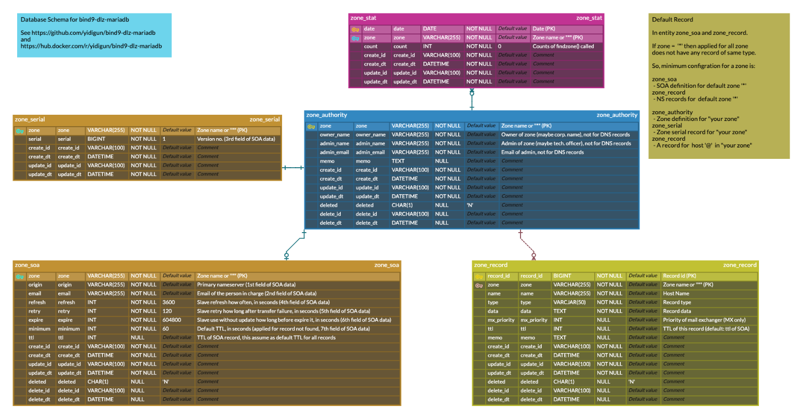

# BIND9 with DLZ Mariadb plugin

## Bind 9 DLZ License

See http://bind-dlz.sourceforge.net/mysql_driver.html and http://bind-dlz.sourceforge.net/license.html

## Bind 9 License

See https://www.isc.org/bind/ and https://www.mozilla.org/en-US/MPL/2.0/

## Dockerfile License

It's just free. (Public Domain)

See https://github.com/yidigun/bind9-dlz-mariadb

## Changelog

* 2022-05-10 - Upgrade base image 20.04 to 22.04
* 2022-02-18 - Change default locale to en_US.UTF-8, timezone to UTC.
               Locale and timezone is set automatically according to
               ```$LANG``` and ```$TZ``` envoringment variables.

## Use Image

### 1. Prepare Database

See mariadb schema [sql/mariadb-schema.sql](https://github.com/yidigun/bind9-dlz-mariadb/blob/master/sql/mariadb-schema.sql)
and [sql/mariadb-example.sql](https://github.com/yidigun/bind9-dlz-mariadb/blob/master/sql/mariadb-example.sql).

#### ER-Diagram

See [https://www.erdcloud.com/d/ZzZmex5p3cWFo7xpx](https://www.erdcloud.com/d/ZzZmex5p3cWFo7xpx).



### 2. Run Daemon

```shell
docker run -d \
  --name bind9-named \
  -e LANG=ko_KR.UTF-8 \
  -e TZ=Asia/Seoul \
  -e MYSQL_HOST=dbserver \
  -e MYSQL_PORT=3306 \
  -e MYSQL_USERNAME=named \
  -e MYSQL_PASSWORD=dns11 \
  -e MYSQL_DBNAME=domaindb \
  -p 53:53/tcp \
  -p 53:53/udp \
  yidigun/bind9-dlz-mariadb
```

#### docker-compose.yaml

```yaml
version: "3.9"

services:
  bind9:
    container_name: bind9-named
    image: docker.io/yidigun/bind9-dlz-mariadb:latest
    restart: unless-stopped
    ports:
      - "53:53/udp"
      - "53:53/tcp"
    environment:
      - TZ=Asia/Seoul
      - LANG=ko_KR.UTF-8
      - MYSQL_HOST=dbserver
      - MYSQL_PORT=3306
      - MYSQL_USERNAME=named
      - MYSQL_PASSWORD=dns11
      - MYSQL_DBNAME=domaindb
    volumes:
      - ${PWD}/cache:/var/cache/bind
      - ${PWD}/data:/var/lib/bind
```

### 3. rndc utility

```shell
docker exec bind9-named rndc reload
```

## Build Image

Note: If you fail to build linux/arm64 image on x86_64 linux machine, 
upgrade qemu-user-static to recent version. See https://github.com/yidigun/build-from-scratch/blob/master/qemu-user-static.md.

```shell
make test   # build single-arch image using docker build for testing
make TAG=... PUSH={yes|no} # build multi-arch image using docker buildx 
```
